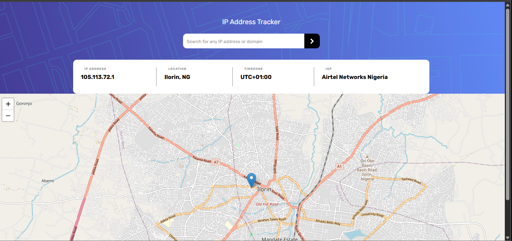

# IP Address Tracker

## Overview

### The challenge

Users should be able to:

- See their own IP Address on the map on the initial page load
- Search for any IP addresses or domains and see the key information and location
- View the optimal layout for each page depending on their device's screen size
- See hover states for all interactive elements on the page

### Screenshot

### Links

- Solution URL: https://github.com/Alike001/IP-Address-Tracker
- Live Site URL:  https://alike001.github.io/IP-Address-Tracker/

## My process

### Built with

- Semantic HTML5
- CSS Flexbox
- CSS Media Queries
- JavaScript (ES6+)
- [Leaflet.js](https://leafletjs.com/) – interactive maps
- [IPify Geolocation API](https://geo.ipify.org/)
- Desktop-first workflow

### What I learned

This project helped me strengthen my understanding of:

- Fetching data from external APIs using `fetch` and `async/await`
- Working with third-party libraries like Leaflet.js
- Updating the DOM based on API responses
- Responsive layouts using media queries

### Useful resources
- W3schools
- Leaflet
- Frontend Mentor

## Author
- Hammed Ali
